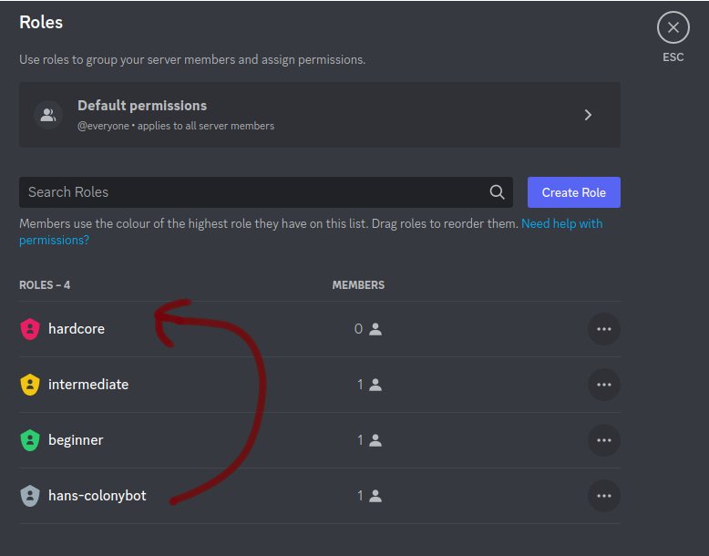

# The discordGatingBot
The discord gating bot can be invited to a discord server and allows to 
gate access to certain roles based on users reputation in the domains of 
a colony. For this the bots registers the 
`/gate <colony> <domain> <reputation> <role>` command for Administrators of the
server. And then a `/check` command for users which will guide them through
registration and than grants them the roles they are entitled to.

One important thing to note is that the role of the bot has to be higher in the
discord role hierarchy than the roles it is supposed to grant. Otherwise it will
not be able to grant them. When the bot joins, the bot role will be always on the
bottom of the hierarchy. 

Check the 
[discord role management 101](https://support.discord.com/hc/en-us/articles/214836687-Role-Management-101)

## Running your own bot
For most users it should be sufficient to just invite the bot
to your server and configure the roles and gates within discord. If you want
however, you can totally run your own instance of the bot. 
For this you can checkout the [backend documentation](backend/README.md)
